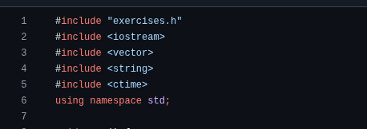
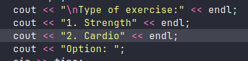
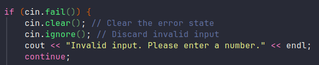
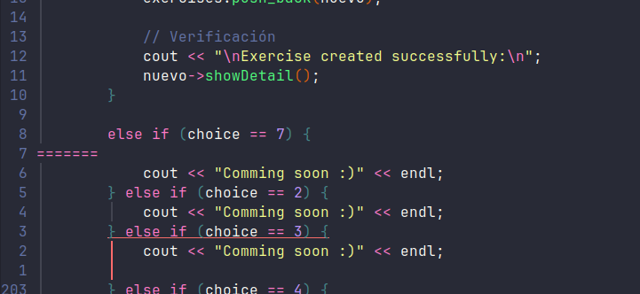

## Review implementation option 1.

> 📝 NOTE
>
> **Remember to run the merge command on your branch to have the latest changes.**

```bash
# Inside of your brach execute this command:
git merge main
```

---

- [ ] ⚠️ There are two missing imports at the beginning of the `main.cpp` file.
       These are in the main branch.


---

- [ ] ♻️  Consider moving the menu into a function to avoid too much code inside
       the main function.
> Try something like `void exerciseType()`.



---

- [ ] ⚠️ It handles cases where the user enters a letter by mistake.
> 💡 **Tip:** Option 4 has an if statement that handles this same error, check it and apply it.



---

- [ ] ⚠️ Be careful and remember to remove and clean the code, as option 7 comes before
      option 2 and is repeated after option 6.



---

> 👍 **Good Job.**

✅  The code works correctly; these tips and observations are only suggestions
    to improve its performance.


> ⚠️ **IMPORTANT**

> When you finish correcting all these errors, remember to check thoroughly and
  then upload the changes and notify us to proceed with the PR.
